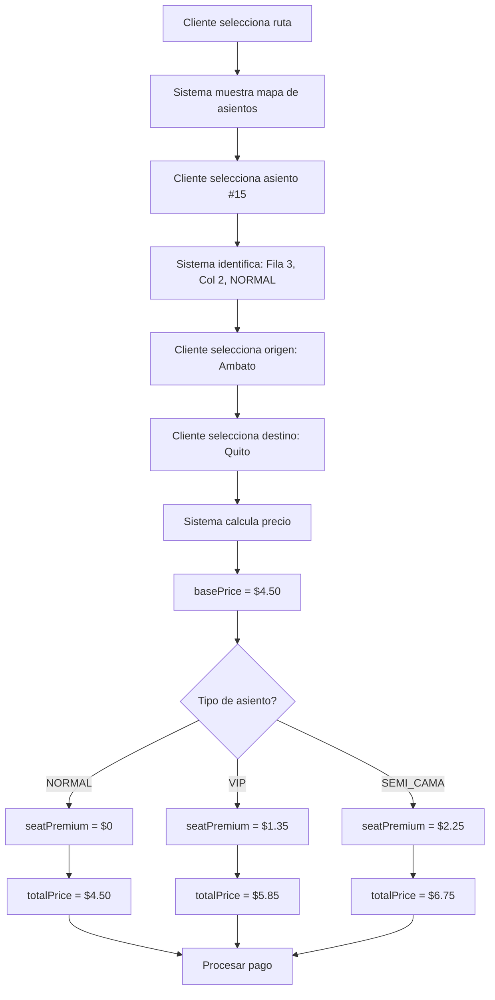

# 💰 Sistema de Precios - MoviPass

## 📊 Resumen del Sistema

MoviPass maneja precios dinámicos basados en:
1. **Ruta y paradas** (origen/destino del pasajero)
2. **Tipo de asiento** (NORMAL, VIP, SEMI_CAMA)

---

## 1️⃣ Precios de Rutas y Paradas

### Configuración en la Ruta

Al crear una ruta, defines:

```json
{
  "name": "Ambato - Quito",
  "origin": "Ambato",
  "destination": "Quito",
  "basePrice": 4.50,  // ← Precio completo (origen → destino)
  "stops": [
    {
      "name": "Latacunga",
      "order": 1,
      "priceFromOrigin": 2.00  // ← Precio desde origen hasta aquí
    },
    {
      "name": "Machachi", 
      "order": 2,
      "priceFromOrigin": 3.00  // ← Precio desde origen hasta aquí
    }
  ]
}
```

### Precios Disponibles

Para la ruta **Ambato - Quito** con paradas:

| Origen | Destino | Precio Base (NORMAL) |
|--------|---------|---------------------|
| Ambato | Latacunga | $2.00 |
| Ambato | Machachi | $3.00 |
| Ambato | Quito | $4.50 |
| Latacunga | Machachi | $1.00* |
| Latacunga | Quito | $2.50* |
| Machachi | Quito | $1.50* |

*Los precios entre paradas intermedias se calculan por diferencia

---

## 2️⃣ Precios por Tipo de Asiento

Los buses tienen 3 tipos de asientos configurables:

### NORMAL
- **Recargo:** 0%
- **Precio:** Igual al precio base de la ruta/parada
- **Ejemplo:** Ambato → Quito = $4.50

### VIP
- **Recargo:** +30%
- **Precio:** Precio base × 1.30
- **Ejemplo:** Ambato → Quito = $4.50 × 1.30 = **$5.85**

### SEMI_CAMA
- **Recargo:** +50%
- **Precio:** Precio base × 1.50  
- **Ejemplo:** Ambato → Quito = $4.50 × 1.50 = **$6.75**

---

## 3️⃣ Cálculo Automático de Precios

Cuando un cliente compra un boleto, el sistema calcula automáticamente:

```typescript
// Ejemplo del sistema
const basePrice = getPriceForRoute(boardingStop, dropoffStop); // $4.50
const seatType = getSeatType(seatNumber); // "VIP"

let seatPremium = 0;
if (seatType === 'VIP') {
  seatPremium = basePrice * 0.30; // $1.35
} else if (seatType === 'SEMI_CAMA') {
  seatPremium = basePrice * 0.50; // $2.25
}

const totalPrice = basePrice + seatPremium; // $5.85
```

---

## 4️⃣ Ejemplos de Precios Completos

### Escenario 1: Bus con Configuración Mixta

**Configuración del Bus:**
```
Filas 1-2: VIP (8 asientos)
Filas 3-8: NORMAL (24 asientos)
Filas 9-10: SEMI_CAMA (8 asientos)
Total: 40 asientos
```

**Ruta:** Ambato → Quito (basePrice: $4.50)

| Asiento | Tipo | Precio Base | Recargo | Precio Total |
|---------|------|-------------|---------|--------------|
| 1-8 | VIP | $4.50 | +$1.35 (30%) | **$5.85** |
| 9-32 | NORMAL | $4.50 | $0.00 | **$4.50** |
| 33-40 | SEMI_CAMA | $4.50 | +$2.25 (50%) | **$6.75** |

### Escenario 2: Viaje Corto con Paradas

**Ruta:** Ambato → Latacunga (priceFromOrigin: $2.00)

| Asiento | Tipo | Precio Base | Recargo | Precio Total |
|---------|------|-------------|---------|--------------|
| 1-8 | VIP | $2.00 | +$0.60 (30%) | **$2.60** |
| 9-32 | NORMAL | $2.00 | $0.00 | **$2.00** |
| 33-40 | SEMI_CAMA | $2.00 | +$1.00 (50%) | **$3.00** |

### Escenario 3: Entre Paradas Intermedias

**Ruta:** Latacunga → Quito

```
Precio base = (Ambato → Quito) - (Ambato → Latacunga)
            = $4.50 - $2.00
            = $2.50
```

| Asiento | Tipo | Precio Base | Recargo | Precio Total |
|---------|------|-------------|---------|--------------|
| 1-8 | VIP | $2.50 | +$0.75 (30%) | **$3.25** |
| 9-32 | NORMAL | $2.50 | $0.00 | **$2.50** |
| 33-40 | SEMI_CAMA | $2.50 | +$1.25 (50%) | **$3.75** |

---

## 5️⃣ Configuración de Asientos en el Bus

### Estructura Estándar

Los buses tienen **2 filas de asientos a cada lado del pasillo** (4 columnas):

```
┌─────────────────────────────────┐
│  [1]  [2]  PASILLO  [3]  [4]   │  ← Fila 0
│  [5]  [6]  PASILLO  [7]  [8]   │  ← Fila 1
│  [9] [10]  PASILLO [11] [12]   │  ← Fila 2
│  ...                            │
│ [37] [38]  PASILLO [39] [40]   │  ← Fila 9
└─────────────────────────────────┘

Columnas:
  0: Lado izquierdo, ventana
  1: Lado izquierdo, pasillo
  2: Lado derecho, pasillo
  3: Lado derecho, ventana
```

### Configuración Recomendada

**Opción 1: Bus Estándar (40 asientos)**
```json
{
  "rows": 10,
  "columns": 4,
  "totalSeats": 40,
  "seats": [
    // Filas 0-1: VIP (8 asientos)
    {"number": 1, "row": 0, "col": 0, "type": "VIP"},
    {"number": 2, "row": 0, "col": 1, "type": "VIP"},
    {"number": 3, "row": 0, "col": 2, "type": "VIP"},
    {"number": 4, "row": 0, "col": 3, "type": "VIP"},
    // ... asientos 5-8 también VIP
    
    // Filas 2-8: NORMAL (28 asientos)
    {"number": 9, "row": 2, "col": 0, "type": "NORMAL"},
    // ... hasta asiento 36
    
    // Filas 9: SEMI_CAMA (4 asientos)
    {"number": 37, "row": 9, "col": 0, "type": "SEMI_CAMA"},
    {"number": 38, "row": 9, "col": 1, "type": "SEMI_CAMA"},
    {"number": 39, "row": 9, "col": 2, "type": "SEMI_CAMA"},
    {"number": 40, "row": 9, "col": 3, "type": "SEMI_CAMA"}
  ]
}
```

**Opción 2: Bus Todo VIP (40 asientos)**
```json
{
  "rows": 10,
  "columns": 4,
  "totalSeats": 40,
  "seats": [
    {"number": 1, "row": 0, "col": 0, "type": "VIP"},
    {"number": 2, "row": 0, "col": 1, "type": "VIP"},
    // ... todos los 40 asientos tipo VIP
  ]
}
```

**Opción 3: Bus Semi-Cama Premium (30 asientos)**
```json
{
  "rows": 10,
  "columns": 3,  // ← Solo 3 columnas para más espacio
  "totalSeats": 30,
  "seats": [
    {"number": 1, "row": 0, "col": 0, "type": "SEMI_CAMA"},
    {"number": 2, "row": 0, "col": 1, "type": "SEMI_CAMA"},
    {"number": 3, "row": 0, "col": 2, "type": "SEMI_CAMA"},
    // ... todos Semi-cama
  ]
}
```

---

## 6️⃣ Visualización de Ingresos Potenciales

### Bus Mixto (40 asientos) - Ruta Ambato → Quito

**Configuración:**
- 8 VIP @ $5.85 = $46.80
- 28 NORMAL @ $4.50 = $126.00
- 4 SEMI_CAMA @ $6.75 = $27.00

**Ingreso Total por Viaje Completo:** $199.80

### Bus Todo VIP (40 asientos) - Ruta Ambato → Quito

**Configuración:**
- 40 VIP @ $5.85 = $234.00

**Ingreso Total por Viaje Completo:** $234.00 (+17% vs bus mixto)

### Bus Semi-Cama Premium (30 asientos) - Ruta Ambato → Quito

**Configuración:**
- 30 SEMI_CAMA @ $6.75 = $202.50

**Ingreso Total por Viaje Completo:** $202.50

---

## 7️⃣ Recomendaciones por Tipo de Ruta

### Rutas Cortas (< 2 horas)
**Recomendación:** Bus estándar con mayoría NORMAL
```
- 4 VIP (primera fila)
- 36 NORMAL
Razonamiento: Viajes cortos no justifican premium alto
```

### Rutas Medias (2-4 horas)
**Recomendación:** Bus mixto balanceado
```
- 8 VIP (primeras 2 filas)
- 28 NORMAL
- 4 SEMI_CAMA (última fila)
Razonamiento: Opciones para diferentes presupuestos
```

### Rutas Largas (> 4 horas)
**Recomendación:** Bus con más premium
```
- 12 VIP (primeras 3 filas)
- 16 NORMAL
- 12 SEMI_CAMA (últimas 3 filas)
Razonamiento: Mayor demanda de comodidad en viajes largos
```

### Rutas Ejecutivas
**Recomendación:** Bus todo VIP o Semi-Cama
```
- 30-40 asientos VIP o SEMI_CAMA
Razonamiento: Servicio premium exclusivo
```

---

## 8️⃣ Flujo Completo de Compra



---

## 9️⃣ Preguntas Frecuentes

### ¿Puedo cambiar los porcentajes de VIP y SEMI_CAMA?

Actualmente son fijos:
- VIP: +30%
- SEMI_CAMA: +50%

Para cambiarlos, modifica en `src/controllers/ticket.controller.ts`:
```typescript
if (seat.type === 'VIP') {
  seatPremium = basePrice * 0.30; // Cambiar este valor
} else if (seat.type === 'SEMI_CAMA') {
  seatPremium = basePrice * 0.50; // Cambiar este valor
}
```

### ¿Puedo tener diferentes precios para el mismo tipo de asiento?

No actualmente. El precio depende solo de:
1. Ruta/parada
2. Tipo de asiento

Todos los asientos VIP cuestan lo mismo, independientemente de su ubicación.

### ¿Cómo manejo descuentos especiales?

Los descuentos deben aplicarse en el frontend antes de crear el ticket, o implementar un campo adicional `discount` en el ticket.

### ¿Puedo tener más de 4 columnas?

Sí, ajusta `columns` en el `seatLayout`. Por ejemplo, para buses de 2 pisos o configuraciones especiales.

---

**Última actualización:** Noviembre 29, 2025
